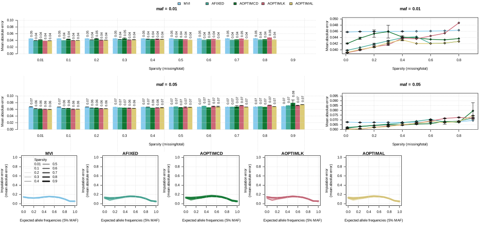
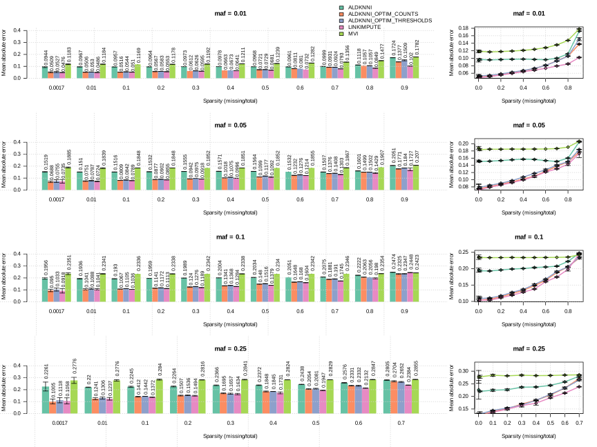
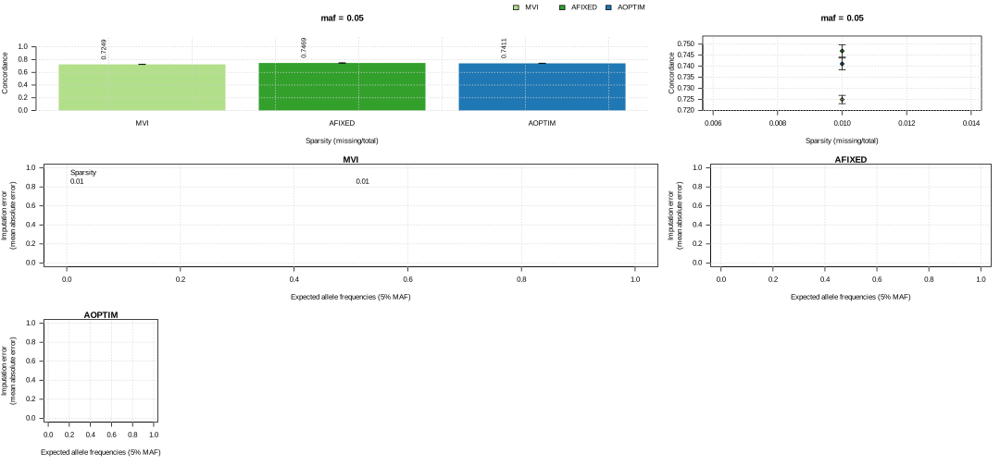
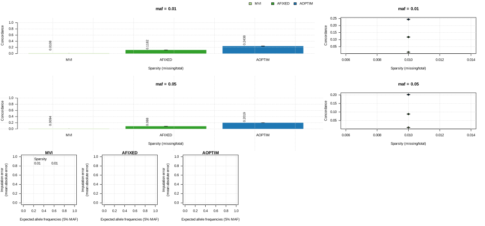
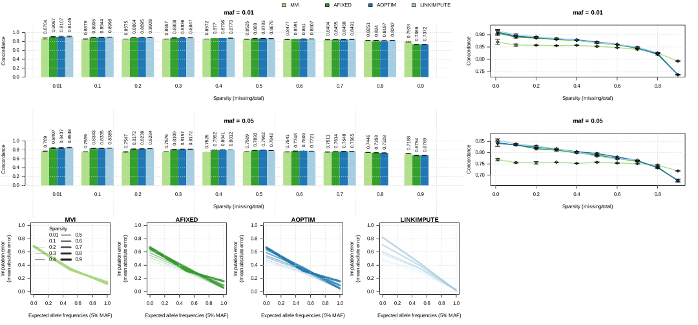
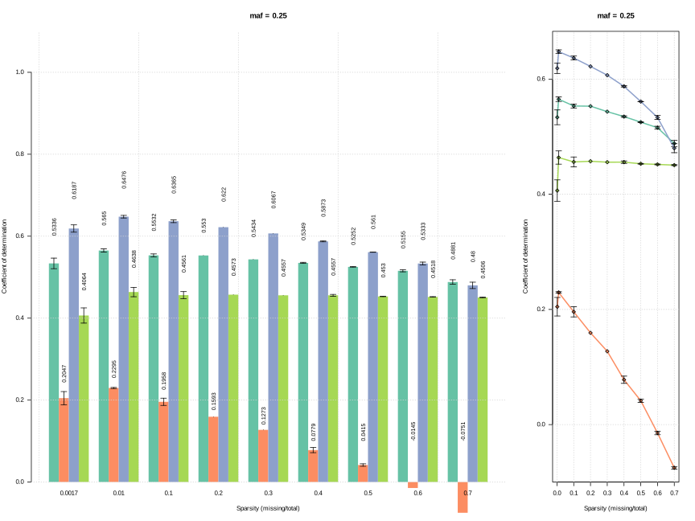
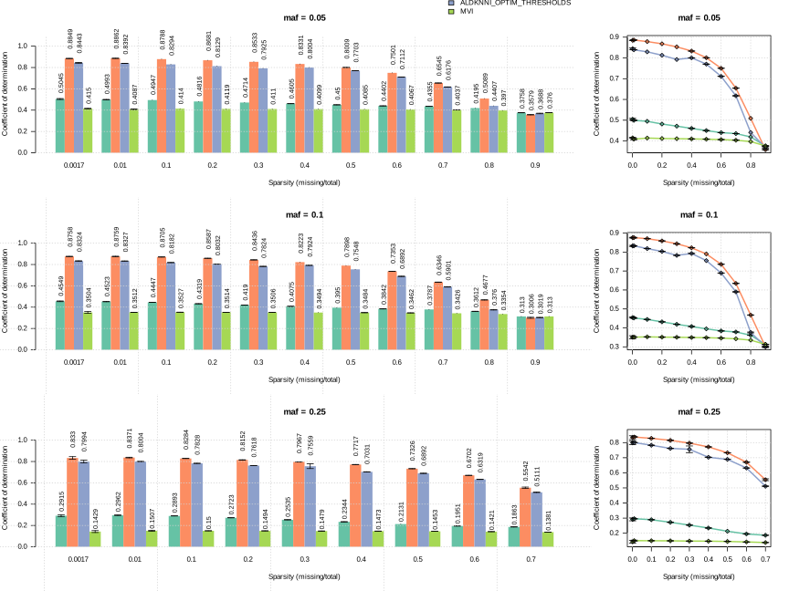
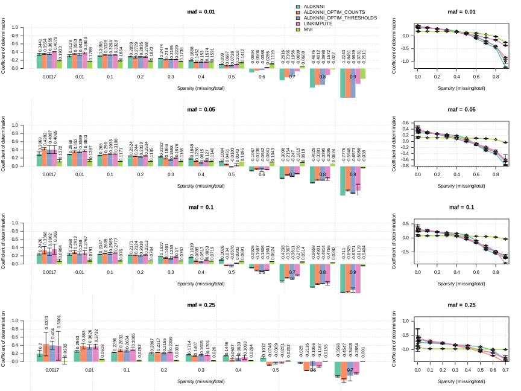

# imputef

Reduce genotype data sparsity through imputation of genotype classes or allele frequencies of individual polyploids or pools of individuals or populations.

|**Build Status**|**License**|
|:--------------:|:---------:|
| <a href="https://github.com/jeffersonfparil/imputef/actions"></a> | [](https://www.gnu.org/licenses/gpl-3.0) |

## Manual installation and development tools

```shell
# Install conda
wget https://repo.anaconda.com/miniconda/Miniconda3-latest-Linux-x86_64.sh
sh ./Miniconda3-latest-Linux-x86_64.sh
# Download the repo
git clone https://jeffersonfparil:<API_KEY>@github.com/jeffersonfparil/imputef.git some_branch
# Create the development environment
conda env create -n rustenv --file imputef/tests/rustenv.yml
conda activate compare_genomes
```

## Installation

```R
usethis::use_git_config(user.name="USERNAME", user.email="EMAIL@EMAIL.COM")
credentials::set_github_pat() ### Enter access token
remotes::install_github("jeffersonfparil/imputef")
```

## Usage

```R
?imputef::mvi
?imputef::aldknni
imputef::mvi(fname="tests/test.vcf")
imputef::aldknni(fname="tests/test.vcf")
```

### Functions

- `mvi`: mean value imputation of allele frequencies

- `aldknni`: adaptive linkage-informed k-nearest neighbour imputation of allele frequencies

### Input variables:

Shared by both functions:

- **fname**: filename of the uncompressed vcf file which has the AD (allele depth) field and may or may not have genotypes called (e.g. generated via `bctools mpileup -a AD,DP ...`). If the GT field is present but the AD field is absent, then each sample is assumed to be an individual diploid, i.e., neither a polyploid nor a pool.
- **min_coverage**: minimum coverage per locus, i.e. if at a locus, a pool falls below this value (does not skip missing data, i.e. missing locus has a depth of zero), then the whole locus is omitted. Set this to zero if the vcf has been filtered and contains missing values, i.e. `./.` or `.|.`. [Default=0]
- **min_allele_frequency**: minimum allele frequency per locus, i.e. if at a locus, a pool has all its alleles below this value and/or above the additive complement of this value (skipping missing data), then the entire locus is omitted. [Default=0.0001]
- **max_missingness_rate_per_locus**: maximum fraction of pools missing per locus, i.e. if at a locus, there were more pools missing than the coverage dictated by this threshold, then the locus is omitted. [Default=1.00]
- **pool_sizes**: vector of pool sizes, i.e. the number of individuals included in each pool, or can be set to an arbitrarily large value like 100 for individual polyploids or if allele frequency estimates are expected to be accurate. [Default=100]
- **min_depth_below_which_are_missing**: minimum depth at which loci with depth below this threshold are set to missing. Set to one if the input vcf has already been filtered and the loci beyond the depth thresholds have been set to missing, otherwise set to an integer above zero. [Default=1]
- **max_depth_above_which_are_missing**: maximum depth at which loci with depth above this threshold are set to missing. Set to some large arbitrarily large value (e.g. 1000000) if the input vcf has already been filtered and the loci beyond the depth thresholds have been set to missing, otherwise set to an integer above zero. [Default=1000000]
- **frac_top_missing_pools**: fraction of pools with the highest number of missing loci to be omitted. Set to zero if the input vcf has already been filtered and the loci beyond the depth thresholds have been set to missing, otherwise set to a decimal number between zero and one. [Default=0.0]
- **frac_top_missing_loci**: fraction of loci with the highest number of pools with missing data to be omitted. Set to zero if the input vcf has already been filtered and the loci beyond the depth thresholds have been set to missing, otherwise set to an decimal number between zero and one. [Default=0.0]
- **n_threads**: number of computing threads or processor cores to use in the computations. [Default=2]
- **fname_out_prefix**: prefix of the output files (sync and csv files). [Default="" which will use the entire name of the input vcf file as the prefix]

Exclusive to `aldknni`:

- **window_size_bp**: non-overlapping window size in bases to be used in the adaptive linkage-informed k-nearest neighbour imputation (aldknni) of allele frequencies. By default, set to the length of the longest chromosome or scaffold. Alternatively, set to the expected linkage block size (e.g. 10,000,000 or 10 megabases) to maximise the use available computing threads and decrease computation time. [Default=0]
- **min_loci_per_window**: minimum number of loci per window to be used in the imputation of allele frequencies. Windows which fail this threshold are omitted. If the default value of one is used, then at very sparse windows the mean value will likely be used for imputation. [Default=1]
- **min_loci_corr**: minimum correlation between loci or number of linked loci. If the former is intended, then this value ranges between 0 and 1, while greater than or equal to 1 if otherwise. Definition 1: Minimum correlation between the locus requiring imputation and other loci deemed to be in linkage with it. Definition 2: The number of linked loci. The resulting linked loci will be used to estimate the distances between pools. If this is set to 0, then this value will be optimised - see additional parameters below. [Default=0.9]
- **max_pool_dist**: maximum distance between the pool or number of nearest neighbours. If the former is intended, then this value ranges between 0 and 1, while greater than or equal to 1 if otherwise. Definition 1: Maximum distance between the pool requiring imputation and other pools deemed to be the closest neighbours. Definition 2: Number of nearest neighbours. The resulting close neighbours will be used to impute. The distance metric is the mean absolute difference between pools across the linked loci. If this is set to 0, then this value will be optimised - see additional parameters below. [Default=0.1]
- **optimise_for_thresholds**: optimise for minimum correlation and maximum distance thresholds if TRUE, else optimise for the number of linked loci and nearest neighbours. [Default=TRUE]
- **optimise_n_steps_corr**: number levels for the optimisation of the minimum loci correlation or number of linked loci. [Default=10]
- **optimise_n_steps_dist**: number levels for the optimisation of the maximum pool distance or number of nearest neighbours. [Default=10]
- **optimise_n_reps**: number of replications for the optimisation of the minimum loci correlation or number of linked loci and maximum pool distance or number of nearest neighbours. [Default=1]
- **misc_min_l**: minimum number of linked loci to be included in imputation if using minimum loci correlation threshold [Default=0].
- **misc_min_k**: minimum number of nearest neighbours to be included in imputation if using maximum distance threshold [Default=0].


## Output

- Imputed allele frequencies:
    + filename: <fname_out_prefix>-<time>-<random_id>-IMPUTED.csv
    + comma-separated file
    + header: ` #chr,pos,allele,<pool_names>,...`
    + each locus is represented by 2 or more rows, i.e. 2 for biallelic loci, and >2 for multi-allelic loci

- Synchronised pileup (sync) file:
    + filename: <fname_out_prefix>-<time>.sync
    + an extension of [popoolation2's](https://academic.oup.com/bioinformatics/article/27/24/3435/306737) sync or synchronised pileup file format, which includes a header line prepended by '#' showing the names of each column including the names of each pool. Additional header line/s and comments prepended with '#' may be added anywhere within the file.
    + *Header line/s*:  optional header line/s including the names of the pools, e.g. `# chr pos ref pool1 pool2 pool3 pool4 pool5`
    + *Column 1*:       chromosome or scaffold name
    + *Column 2*:       locus position 
    + *Column 3*:       reference allele, e.g. A, T, C, G 
    + *Column/s 4 to n*:  colon-delimited allele counts: A:T:C:G:DEL:N, where "DEL" refers to insertion/deletion, and "N" is unclassified. A pool or population or polyploid individual is represented by a single column of this colon-delimited allele counts.


## Details

### `mvi`: mean value imputation

This imputation uses the arithmetic mean of the observed allele frequencies across all samples where the locus was genotyped:

$$
\hat q_{r,j} = { {1 \over (n-m)} { \sum_{i \ne r}^{n} q_{i,j} } }
$$

where:

- $\hat q_{r,j}$ is the imputed allele frequency of sample $r$ at the $j^{\text {th}}$ locus,
- $n$ is the total number of samples,
- $m$ is the number of samples which are missing data at the $j^{\text {th}}$ locus, and
- $q_{i,j}$ is the known allele frequency of the $i^{\text {th}}$ sample at the $j^{\text {th}}$ locus.

### `aldknni`: adaptive linkage disequilibrium (LD)-based k-nearest neighbour imputation of genotype data

This is an attempt to extend the [LD-kNNi method of Money et al, 2015, i.e. LinkImpute](https://doi.org/10.1534/g3.115.021667), which was an extension of the [kNN imputation of Troyanskaya et al, 2001](https://doi.org/10.1093/bioinformatics/17.6.520). Similar to LD-kNNi, LD is estimated using Pearson's product moment correlation per pair of loci, but instead of computing this across the entire dataset (or across the whole genome), we divide the genome into windows which respect chromosomal/scaffold boundaries. We use the mean absolute difference between allele frequencies as an estimate of distance between samples. Instead of optimising for the number of loci to include in the distance estimation and the number neighbours to include in the weighted allele frequency mean, we use a minimum correlation coefficient for the former, and a maximum distance for the latter. Both of these parameters range from 0 to 1 and can be separately optimised, but a single pair of reasonable values is expected to result in good imputation accuracy, e.g. the default values of 0.9 minimum correlation, and 0.1 maximum distance. The adaptive behaviour of our algorithm can be described in cases where:

 - sparsity in the data is too high, or 
 - loci are too uncorrelated because the breadth of coverage is too sparse, or
 - pools are too unrelated.

These cases can mean that the data may not be informative enough to yield LD-kNN imputations better than mean value imputation. Hence under these cases, mean value imputation will be used instead of our version of LD-kNN imputation. This function prints out the expected mean absolute error (MAE) of the imputation using 10% simulated missing data. Repeat the imputation manually to get a range of these MAEs for a better estimate of the expected MAE.

This function does not import any genotype data into R. Most processes are multi-threaded and outputs are written into disk as text files, i.e. [sync](https://github.com/jeffersonfparil/poolgen#sync) file, and csv file of imputed allele frequencies with the following fields: chromosome, position, allele, sample 1, ..., sample $n$ (where reference and alternative alleles are included and can accommodate multi-allelic loci). It converts vcf into sync with locus filtering based on minimum depth, minimum allele frequency, and maximum missingness rate with minimal memory footprint as large [vcf](https://github.com/jeffersonfparil/poolgen#variant-call-format-vcf) files are split into chunks equivalent to the number of threads and processed line-by-line. The allele depth information (AD), i.e. the unfiltered allele depth which includes the reads which did not pass the variant caller filters are used to calculate allele frequencies. The genotype calls, if present are not used, hence the variant caller filtering is unimportant as only the allele frequencies are extracted from the the vcf file. The entire sync file is then loaded into memory and imputed in parallel across windows. The structs, traits, methods, and functions defined in this library are subsets of [poolgen](https://github.com/jeffersonfparil/poolgen), and will eventually be merged with it. 

The imputed allele frequency is computed as:

$$
\hat q_{r,j} = { \sum_{i \ne r}^{k} q_{i,j} (1 - \delta_{i,r}) }
$$

with:

$$
\delta_{i,r} = { {1 \over \sum d_{i,r}} d_{i,r} }
$$

and

$$
d_{i,r} = { {1 \over c} { \sum_{j=1}^{c} |q_{i,j} - q_{r,j}| } }
$$

where:

- $\hat q_{r,j}$ is the imputed allele frequency of sample $r$ at the $j^{\text {th}}$ locus,
- $n$ is the total number of samples,
- $m$ is the number of samples which are missing data at the $j^{\text {th}}$ locus,
- $q_{i,j}$ is the known allele frequency of the $i^{\text {th}}$ sample at the $j^{\text {th}}$ locus,
- $k$ is the number of nearest neighbours or the samples most closely related to the sample requiring imputation, i.e. sample $r$ at locus $j$, and
- $\delta_{i,r}$ is scaled $d_{i,r}$ which is the genetic distance between the $i^{\text {th}}$ sample and sample $r$. This distance is the mean absolute difference in allele frequencies between the two samples across $c$ linked loci.

The variables $k$ and $c$ are proportional to the user inputs `max_pool_dist` (default=0.1) and `min_loci_corr` (default=0.9), respectively. The former defines the maximum distance of samples to be considered as one of the k-nearest neighbours, while the latter refers to the minimum correlation with the locus requiring imputation to be included in the estimation of the genetic distance.

## Performance evaluation

Datasets: 

- autotetraploid *Medicago sativa* (2n=4x=32; 2.74 Gb genome; 155 samples x 124,151 biallelic loci; in-house source)
- diploid *Cucurbita pepo* (2n=2x=40; 0.25 Gb genome; 830 samples x 41,888 biallelic loci; source: [http://gong_lab.hzau.edu.cn/Plant_imputeDB/#!/download_cucurbita](http://gong_lab.hzau.edu.cn/Plant_imputeDB/#!/download_cucurbita))
- pools of diploid *Glycine max* (2n=2x=20; 1.15 Gb genome; 478 pools (each pool comprised of 42 individuals) x 39,636 biallelic loci; source: [http://gong_lab.hzau.edu.cn/Plant_imputeDB/#!/download_soybean](http://gong_lab.hzau.edu.cn/Plant_imputeDB/#!/download_soybean))

Performance metrics:

- Concodance: $c = {{1 \over n} \Sigma_{i=1}^{n} p}$, where: $p=
\begin{cases}
0 \text{ if } \hat g \ne g_{true}\\
1 \text{ if } \hat g = g_{true}
\end{cases}
$.
This is used for genotype classes, i.e., binned allele frequencies: $g = {{1 \over {ploidy}} round(q*ploidy)}$, here $q = P(allele)$. Note that there is alternative way of defining these genotype classes with strict boundaries, i.e., homozygotes have fixed allele frequencies.
- Mean absolute error: $mae = {{1 \over n} \Sigma_{i=1}^{n}|\hat q - q_{true}|}$.
- Coefficient of determination: $R^2 = { 1 - {{\Sigma_{}^{}(\hat q - q_{true})^2} \over {\Sigma_{}^{}(\hat q_{true} - \bar q_{true})^2}} }$


### Autotetraploid (Lucerne) mean absolute error



### Pool (Soybean pools) mean absolute error


### Diploid (Grape) mean absolute error



------------------------------------------------------------------------------------
------------------------------------------------------------------------------------
------------------------------------------------------------------------------------

### Autotetraploid (Lucerne) concordance of observed and imputed genotype classes



### Pool (Soybean pools) concordance of observed and imputed genotype classes



### Diploid (Grape) concordance of observed and imputed genotype classes



------------------------------------------------------------------------------------
------------------------------------------------------------------------------------
------------------------------------------------------------------------------------

### Autotetraploid (Lucerne) coefficient of determination



### Pool (Soybean pools) coefficient of determination



### Diploid (Grape) coefficient of determination




## References

- Money D, Gardner K, Migicovsky Z, Schwaninger H, Zhong GY, Myles S. LinkImpute: fast and accurate genotype imputation for nonmodel organisms. G3: Genes|Genomes|Genetics. 2015;5(11):2383–90. doi:10.1534/g3.115.021667.
- Troyanskaya O, Cantor M, Sherlock G, Brown P, Hastie T et al. , 2001 Missing value estimation methods for DNA microarrays. Bioinformatics 17: 520–525.
- Schwender H, 2012 Imputing missing genotypes with weighted k nearest neighbors. J. Toxicol. Environ. Health A 75: 438–446.

## Acknowledgements

This work was conceived and developed during my employment in Agriculture Victoria. The imputation algorithm in this repo was inspired by the algorithms presented in the 3 papers above and Luke Pembletton's tetraploid imputation algorithm written in R.
