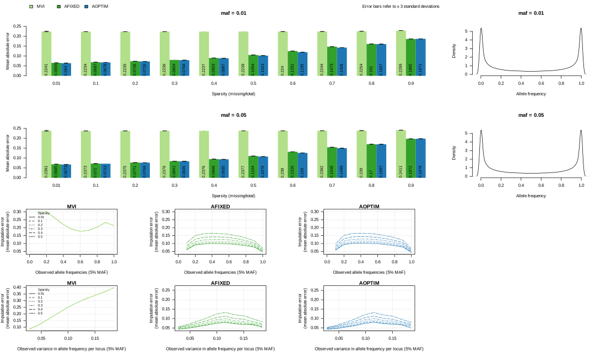
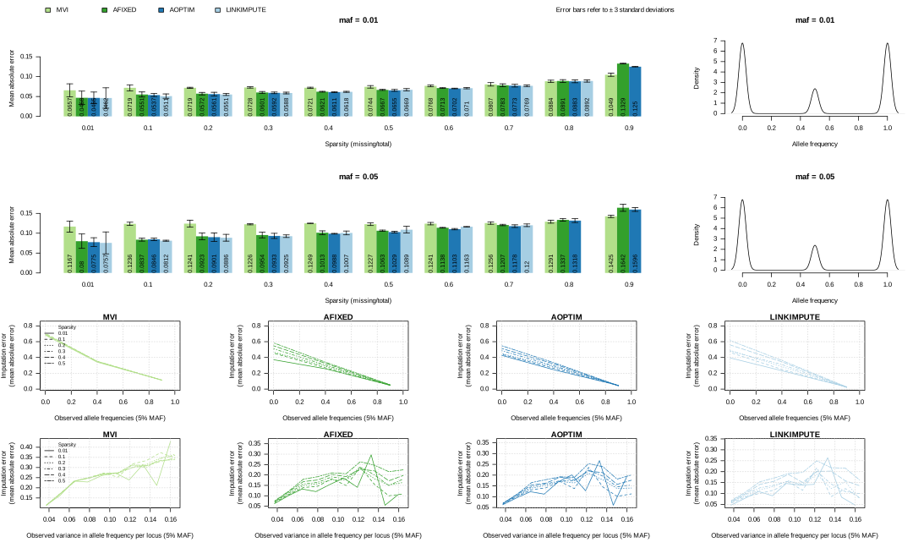
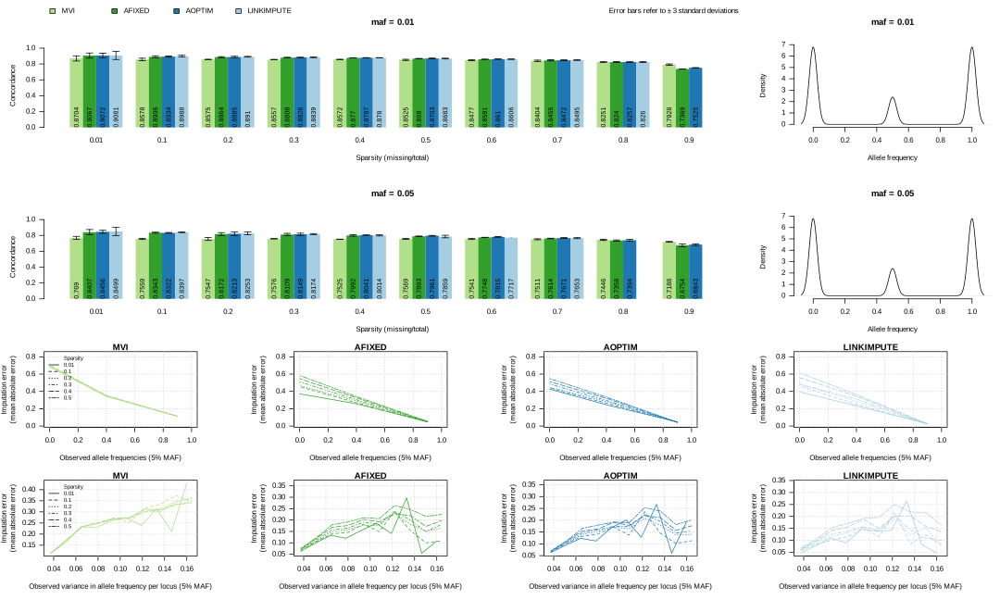

# imputef

Impute allele frequencies to reduce sparsity of genotype data from polyploids, pooled individuals, and populations.

|**Build Status**|**License**|
|:--------------:|:---------:|
| <a href="https://github.com/jeffersonfparil/imputef/actions"></a> | [](https://www.gnu.org/licenses/gpl-3.0) |

## Installation

```shell
cargo build --release
target/release/imputef -h
```

## Usage


### Functions

- `mvi`: mean value imputation of allele frequencies

- `aldknni`: adaptive linkage-informed k-nearest neighbour imputation of allele frequencies

### Input variables

Shared by both functions:

- **fname**: name of the genotype file to be imputed in uncompressed [vcf](#variant-call-format-vcf), [sync](#synchronised-pileup-sync), or [allele frequency table](#allele-frequency-table-csv). Details on these genotype formats are available below.

Exclusive to `aldknni`:

- **min_loci_corr**: minimum correlation (Pearson's correlation) between the locus requiring imputation and other loci deemed to be in linkage with it. Ranges from 0.0 to 1.0. If using the default value with is NA, then this threshold will be optimised to find the best value minimising imputation error. [Default=0.9]
- **max_pool_dist**: maximum genetic distance (mean absolute difference in allele frequencies) between the pool or sample requiring imputation and pools or samples deemed to be the closest neighbours. Ranges from 0.0 to 1.0. If using the default value with is NA, then this threshold will be optimised to find the best value minimising imputation error. [Default=01]
- **min_l_loci**: minimum number of linked loci to be used in estimating genetic distances between the pool or sample requiring imputation and other pools or samples. Minimum value of 1. This parameter has precedence over ***min_loci_corr**, such that the minimum loci correlation threshold will not hold if the minimum number of loci is not reached. [Default=20]
- **min_k_neighbours**: minimum number of k-nearest neighbours of the pool or sample requiring imputation. Minimum value of 1. This parameter has precedence over ***max_pool_dist**, such that the maximum genetic distance threshold will not hold if the minimum number of k-neighbours is not reached. [Default=5]
- **restrict_linked_loci_per_chromosome**: restrict the choice of linked loci to within the chromosome the locus requiring imputation belong to? [Default=TRUE]
- **n_reps**: number of replications for the optimisation for the minimum loci correlation, and/or maximum genetic distance. Minimum value of 1. [Default=20]


## Genotype data formats

### Note

**Header line/s and comments should be prepended by '#'.**

### Variant call format (vcf)

Canonical variant calling or genotype data format for individual samples. This should include the `AD` field (allele depth), and may or may not have genotypes called (e.g. generated via bctools mpileup -a AD,DP ...). If the `GT` field is present but the `AD` field is absent, then each sample is assumed to be an individual diploid, i.e., neither a polyploid nor a pool. The [`vcf2sync`](#vcf2sync) utility is expected to work with vcf versions 4.2 and 4.3. See [VCFv4.2](https://samtools.github.io/hts-specs/VCFv4.2.pdf) and [VCFv4.3](https://samtools.github.io/hts-specs/VCFv4.3.pdf) for details in the format specifications.

### Synchronised pileup (sync)
    + an extension of [popoolation2's](https://academic.oup.com/bioinformatics/article/27/24/3435/306737) sync or synchronised pileup file format, which includes a header line prepended by '#' showing the names of each column including the names of each pool. Additional header line/s and comments prepended with '#' may be added anywhere within the file.
    + tab-delimited
    + *Header line/s*:  optional header line/s including the names of the pools, e.g. `# chr pos ref pool1 pool2 pool3 pool4 pool5`
    + *Column 1*:       chromosome or scaffold name
    + *Column 2*:       locus position 
    + *Column 3*:       reference allele, e.g. A, T, C, G 
    + *Column/s 4 to n*:  colon-delimited allele counts: A:T:C:G:DEL:N, where "DEL" refers to insertion/deletion, and "N" is unclassified. A pool or population or polyploid individual is represented by a single column of this colon-delimited allele counts.

### Allele frequency table (csv)
    + comma-delimited
    + *Header line*: ` #chr,pos,allele,<pool_name_1>,...,<pool_name_n>`
    + each locus is represented by 2 or more rows, i.e. 2 for biallelic loci, and >2 for multi-allelic loci


## Details

Imputation of genotype data from sequencing of more than 2 sets of genomes, i.e. polyploid individuals, population samples, or pools of individuals. This library can also perform simple genotype data filtering prior to imputation. Two imputation methods are available: (1) mean value imputation which uses the arithmentic mean of the locus across non-missing pools (`?imputef::mvi`); (2) adaptive linkage-informed k-nearest neighbour imputation (`?imputef::aldknni`). This is an attempt to extend the [LD-kNNi method of Money et al, 2015, i.e. LinkImpute](https://doi.org/10.1534/g3.115.021667), which was an extension of the [kNN imputation of Troyanskaya et al, 2001](https://doi.org/10.1093/bioinformatics/17.6.520). Similar to LD-kNNi, LD is estimated using Pearson's product moment correlation across loci per pair of samples. Mean absolute difference in allele frequencies is used to define genetic distance between samples, instead of taxicab or Manhattan distance in LD-kNNi. Four parameters can be set by the user, (1) minimum loci correlation threshold: dictates the minimum LD between the locus requiring imputation and other loci which will be used to estimate genetic distance between samples; (2) maximum genetic distance threshold: sets the maximum genetic distance between the sample requiring imputation and the samples (i.e. nearest neighbours) to be used in weighted mean imputation of missing allele frequencies; (3) minimum number of loci linked to the locus requiring imputation: overrides minimum loci correlation threshold if this minimum is not met; and (4) minimum k-nearest neighbours: overrides maximum genetic distance threshold if this minimum is not met. The first two parameters (minimum loci correlation and maximum genetic distance thresholds) can be optimised per locus requiring imputation using non-missing samples as replicates simulating missing data to minimum the mean absolute error in imputation.

### `mvi`: mean value imputation

This imputation uses the arithmetic mean of the observed allele frequencies across all samples where the locus was genotyped:

$$
\hat q_{r,j} = { {1 \over (n-m)} { \sum_{i \ne r}^{n} q_{i,j} } }
$$

where:

- $\hat q_{r,j}$ is the imputed allele frequency of sample $r$ at the $j^{\text {th}}$ locus,
- $n$ is the total number of samples,
- $m$ is the number of samples which are missing data at the $j^{\text {th}}$ locus, and
- $q_{i,j}$ is the known allele frequency of the $i^{\text {th}}$ sample at the $j^{\text {th}}$ locus.

### `aldknni`: adaptive linkage disequilibrium (LD)-based k-nearest neighbour imputation of genotype data

This is an attempt to extend the [LD-kNNi method of Money et al, 2015, i.e. LinkImpute](https://doi.org/10.1534/g3.115.021667), which was an extension of the [kNN imputation of Troyanskaya et al, 2001](https://doi.org/10.1093/bioinformatics/17.6.520). Similar to LD-kNNi, linkage disequilibrium (LD) is estimated using Pearson's product moment correlation per pair of loci, which is computed per chromosome by default, but can be computed across the entire genome. We use the mean absolute difference/error (MAE) between allele frequencies among linked loci as an estimate of genetic distance between samples. Fixed values for the minimum correlation to identify loci used in distance estimation, and maximum genetic distance to select the k-nearest neighbours can be defined. Additionally, minimum number of loci to include in distance estimation, and minimum number of nearest neighbours can be set. Moreover, all four parameters can be optimised, i.e. the minimum correlation and/or maximum distance and/or minimum number of loci and/or minimum number of nearest neighbours which minimises the MAE between predicted and expected allele frequencies after simulating 10% missing data are identified.

The allele depth information (`AD`), i.e. the unfiltered allele depth which includes the reads which did not pass the variant caller filters are used to calculate allele frequencies. If the `GT` field is present but the `AD` field is absent, then each sample is assumed to be an individual diploid, i.e., neither a polyploid nor a pool. Optional filtering steps based on minimum depth, minimum allele frequency, and maximum sparsity are available. Genotype data are not imported into R, LD estimation and imputation per se are multi-threaded, and imputation output is written into disk as an [allele frequency table](#allele-frequency-table-csv). The structs, traits, methods, and functions defined in this library are subsets of [poolgen](https://github.com/jeffersonfparil/poolgen), and will eventually be merged. 

The imputed allele frequency is computed as:

$$
\hat q_{r,j} = { \sum_{i \ne r}^{k} q_{i,j} (1 - \delta_{i,r}) }
$$

with:

$$
\delta_{i,r} = { {1 \over \sum d_{i,r}} d_{i,r} }
$$

and

$$
d_{i,r} = { {1 \over c} { \sum_{j=1}^{c} |q_{i,j} - q_{r,j}| } }
$$

where:

- $\hat q_{r,j}$ is the imputed allele frequency of sample $r$ at the $j^{\text {th}}$ locus,
- $n$ is the total number of samples,
- $m$ is the number of samples which are missing data at the $j^{\text {th}}$ locus,
- $q_{i,j}$ is the known allele frequency of the $i^{\text {th}}$ sample at the $j^{\text {th}}$ locus,
- $k$ is the number of nearest neighbours or the samples most closely related to the sample requiring imputation, i.e. sample $r$ at locus $j$, and
- $\delta_{i,r}$ is scaled $d_{i,r}$ which is the genetic distance between the $i^{\text {th}}$ sample and sample $r$. This distance is the mean absolute difference in allele frequencies between the two samples across $c$ linked loci.

The variables $k$ and $c$ are proportional to the user inputs `max_pool_dist` (default=0.1) and `min_loci_corr` (default=0.9), respectively. The former defines the maximum distance of samples to be considered as one of the k-nearest neighbours, while the latter refers to the minimum correlation with the locus requiring imputation to be included in the estimation of the genetic distance.

## Performance evaluation

Datasets: 

- autotetraploid *Medicago sativa* (2n=4x=32; 2.74 Gb genome; 155 samples x 124,151 biallelic loci; in-house source)
- diploid *Vitis vinifera* (2n=2x=38; 0.5 Gb genome; 77 samples x 8,506 loci biallelic; [Money et al., 2015](https://doi.org/10.1534/g3.115.021667)) with the 2.90% missing data prior to sparsity simulations
- pools of diploid *Glycine max* (2n=2x=20; 1.15 Gb genome; 478 pools (each pool comprised of 42 individuals) x 39,636 biallelic loci; source: [http://gong_lab.hzau.edu.cn/Plant_imputeDB/#!/download_soybean](http://gong_lab.hzau.edu.cn/Plant_imputeDB/#!/download_soybean))

Performance metrics:

- Concordance: $c = {{1 \over n} \Sigma_{i=1}^{n} p}$, where: $p=
\begin{cases}
0 \text{ if } \hat g \ne g_{true}\\
1 \text{ if } \hat g = g_{true}
\end{cases}
$.
This is used for genotype classes, i.e., binned allele frequencies: $g = {{1 \over {ploidy}} round(q*ploidy)}$, here $q = P(allele)$. Note that there is alternative way of defining these genotype classes with strict boundaries, i.e., homozygotes have fixed allele frequencies.
- Mean absolute error: $mae = {{1 \over n} \Sigma_{i=1}^{n}|\hat q - q_{true}|}$.
- Coefficient of determination: $R^2 = { 1 - {{\Sigma_{}^{}(\hat q - q_{true})^2} \over {\Sigma_{}^{}(\hat q_{true} - \bar q_{true})^2}} }$

------------------------------------------------------------------------------------
------------------------------------------------------------------------------------
------------------------------------------------------------------------------------

### Autotetraploid (Lucerne) mean absolute error


### Pool (Soybean pools) mean absolute error



### Diploid (Grape) mean absolute error



------------------------------------------------------------------------------------
------------------------------------------------------------------------------------
------------------------------------------------------------------------------------

### Autotetraploid (Lucerne) concordance of observed and imputed genotype classes


### Pool (Soybean pools) concordance of observed and imputed genotype classes


### Diploid (Grape) concordance of observed and imputed genotype classes



------------------------------------------------------------------------------------
------------------------------------------------------------------------------------
------------------------------------------------------------------------------------


## References

- Money D, Gardner K, Migicovsky Z, Schwaninger H, Zhong GY, Myles S. LinkImpute: fast and accurate genotype imputation for nonmodel organisms. G3: Genes|Genomes|Genetics. 2015;5(11):2383–90. doi:10.1534/g3.115.021667.
- Troyanskaya O, Cantor M, Sherlock G, Brown P, Hastie T et al. , 2001 Missing value estimation methods for DNA microarrays. Bioinformatics 17: 520–525.
- Schwender H, 2012 Imputing missing genotypes with weighted k nearest neighbors. J. Toxicol. Environ. Health A 75: 438–446.

## Acknowledgements

This work was conceived and developed during my employment in Agriculture Victoria. The imputation algorithm in this repo was inspired by the algorithms presented in the 3 papers above and Luke Pembletton's tetraploid imputation algorithm written in R.
