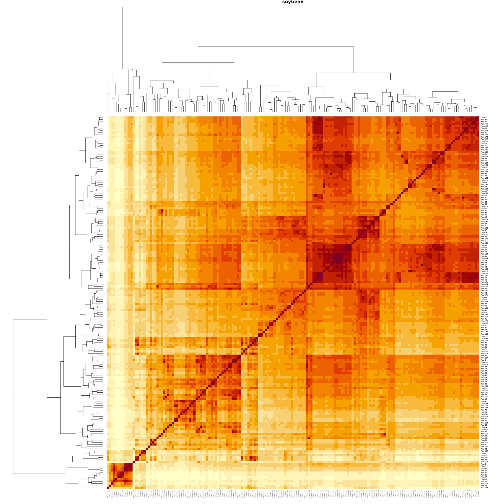

# Assessing imputation accuracies

## Variables and datasets

- 3 imputation algorithms: 
    + **ALDKNNI**: adaptive LD-kNN imputation
    + **ALDKNNI_OPTIM_THRESHOLDS**: adaptive LD-kNN imputation with optimisation for the minimum loci correlation and maximum pool distance
    + **ALDKNNI_OPTIM_COUNTS**: adaptive LD-kNN imputation with optimisation for the number of linked loci correlation and k-nearest neighbours
    + **MVI**: mean value imputation
    <!-- + **SAMP**: Luke's LD-kNN imputation algorithm vias sampling from a normal distribution whose parameters depend on the k-nearest neighbours -->
- 2 minor allele frequency thresholds:
    + 0.01
    + 0.05
- 10 sparsity levels (missing rate):
    + 0.01
    + 0.1
    + 0.2
    + 0.3
    + 0.4
    + 0.5
    + 0.6
    + 0.7
    + 0.8
    + 0.9
- 5 datasets (**Note**: Place these data into `imputef/misc`)
    + autotetraploid *Medicago sativa* (2n=4x=32; 2.74 Gb genome; 155 samples x 124,151 biallelic loci; in-house source)
    + pools of diploid *Glycine max* (2n=2x=20; 1.15 Gb genome; 478 pools (each pool comprised of 42 individuals) x 39,636 biallelic loci; source: [http://gong_lab.hzau.edu.cn/Plant_imputeDB/#!/download_soybean](http://gong_lab.hzau.edu.cn/Plant_imputeDB/#!/download_soybean))
    + diploid *Vitis vinifera* (2n=2x=38; 0.5 Gb genome; 77 samples x 8,506 biallelic loci; source: [https://oup.silverchair-cdn.com/oup/backfile/Content_public/Journal/g3journal/5/11/10.1534_g3.115.021667/5/021667_files1.zip?Expires=1706750617&Signature=yMBQeDumKhnNHIhhUdwsdac~D81t~5RfRi39Bqs4fA8sdE27FVMiyYI7xL8OvLupTqXUim2qC5mgvd5eqby4WCWxCw8x25xnkd6~05gC6puXpHloQSbesTQGrTFios7JeCnXUf306Z~p2vMi0TRgX8qpNTWiwGwwyn2wYAr1tbWIN4EwTQvN8~BgJF31Tj8xJoCVJm2uTpA7~hhsSidJgxVqL4aO20CvwAI1iDcx1gxvienNDS1rYTOruLhwXDif4RGFv8tAb2W5SK3qt4bjgpD6mP8gghv7BWGf0g-arYQywL1fmLCia35qJr7Umxc3LM8iPvWabo5K0sTlRH1oHw__&Key-Pair-Id=APKAIE5G5CRDK6RD3PGA](https://oup.silverchair-cdn.com/oup/backfile/Content_public/Journal/g3journal/5/11/10.1534_g3.115.021667/5/021667_files1.zip?Expires=1706750617&Signature=yMBQeDumKhnNHIhhUdwsdac~D81t~5RfRi39Bqs4fA8sdE27FVMiyYI7xL8OvLupTqXUim2qC5mgvd5eqby4WCWxCw8x25xnkd6~05gC6puXpHloQSbesTQGrTFios7JeCnXUf306Z~p2vMi0TRgX8qpNTWiwGwwyn2wYAr1tbWIN4EwTQvN8~BgJF31Tj8xJoCVJm2uTpA7~hhsSidJgxVqL4aO20CvwAI1iDcx1gxvienNDS1rYTOruLhwXDif4RGFv8tAb2W5SK3qt4bjgpD6mP8gghv7BWGf0g-arYQywL1fmLCia35qJr7Umxc3LM8iPvWabo5K0sTlRH1oHw__&Key-Pair-Id=APKAIE5G5CRDK6RD3PGA))

- **Genome partitioning:**
    + **By chromosomes or scaffolds**
    + **Rename all chromosomes as chr1**

*prepping_datasets.sh*

```shell
#!/bin/bash
conda activate bcftools
DIR=/group/pasture/Jeff/imputef/misc
cd $DIR
### (2) pools of diploid *Glycine max*
for chr in $(seq 1 20); do wget http://gong_lab.hzau.edu.cn/static/PLimputeDB/download/species/soybean/panel/soybean_impute_Chr${chr}.vcf.gz; done
ls soybean_impute_Chr* > soybean-vcf.txt
for f in $(cat soybean-vcf.txt); do echo $f; gunzip ${f}; bgzip ${f%.gz*}; tabix ${f}; done
bcftools concat $(cat soybean-vcf.txt) -Ov -o soybean-indi_temp.vcf
time Rscript poolify.R \
    soybean-indi_temp.vcf \
    42 \
    100 \
    soybean.vcf
rm soybean_impute_Chr* soybean-vcf.txt soybean-indi_temp.vcf
### (3) diploid grape from the LinkImpute paper with missing data filled in with MVI to be fair with the other datasets
time Rscript \
    ssv2vcf.R \
    LinkImpute.data.grape.num.raw.txt \
    zucchini.vcf
mv LinkImpute.data.grape.num.raw.txt.vcf grape.vcf
```

*poolify.R* - assumes each individual per pool are perfectly equally represented (best-case scenario in the real-world)

```R
args = commandArgs(trailingOnly=TRUE)
# args = c("/group/pasture/Jeff/imputef/misc/soybean-indi_temp.vcf", "42", "100", "/group/pasture/Jeff/imputef/misc/soybean.vcf")
vcf_fname = args[1]
min_pool_size = as.numeric(args[2])
depth = as.numeric(args[3])
out_fname = args[4]
print("###############################################################################################################")
print("Pooling individual diploid genotypes, i.e. each pool is comprised of {min_pool_size} most closely-related samples using k-means clustering using 1000 evenly indexes loci")
print("Note: assumes each individual per pool are perfectly equally represented (best-case scenario in the real-world)")
vcf = vcfR::read.vcfR(vcf_fname)
vec_loci_names = paste(vcfR::getCHROM(vcf), vcfR::getPOS(vcf), vcfR::getREF(vcf), sep="_")
vec_sample_names = colnames(vcf@gt)[-1]
### Extract biallelic diploid allele frequencies
G = matrix(NA, nrow=length(vec_loci_names), ncol=length(vec_sample_names))
GT = vcfR::extract.gt(vcf, element="GT")
G[(GT == "0/0") | (GT == "0|0")] = 1.0
G[(GT == "1/1") | (GT == "1|1")] = 0.0
G[(GT == "0/1") | (GT == "0|1") | (GT == "1|0")] = 0.5
rm(GT)
gc()
rownames(G) = vec_loci_names
colnames(G) = vec_sample_names
### Create n pools of the most related individuals
print("Clustering. This may take a while.")
PCA = prcomp(G, rank=100)
C = PCA$rotation
p = length(vec_loci_names)
# C = t(G[seq(from=1, to=p, length=1000), ])
clustering = kmeans(x=C, centers=200, iter.max=20)
vec_clusters = table(clustering$cluster)
vec_clusters = vec_clusters[vec_clusters >= min_pool_size]
n = length(vec_clusters)
GT = matrix("AD", nrow=p, ncol=n+1)
pb = txtProgressBar(min=0, max=n, initial=0, style=3)
for (i in 1:n) {
    idx = which(clustering$cluster == i)
    q = rowMeans(G[, idx])
    for (j in 1:p) {
        # j = 1
        ref = rbinom(n=1, size=depth, prob=q[j])
        alt = rbinom(n=1, size=depth, prob=(1-q[j]))
        GT[j, (i+1)] = paste0(ref, ",", alt) ### skipping the first column containing the FORMAT field "AD"
    }
    setTxtProgressBar(pb, i)
}
close(pb)
colnames(GT) = c("FORMAT", paste0("Pool-", c(1:n)))
### Create the output vcfR object
vcf_out = vcf
str(vcf_out)
str(vcf_out@gt)
vcf_out@gt = GT
fname_vcf_gz = paste0(out_fname, ".gz")
vcfR::write.vcf(vcf_out, file=fname_vcf_gz)
system(paste0("gunzip -f ", fname_vcf_gz))
print(paste0("Output: ", out_fname))
```

*ssv2vcf.R* - convert space-delimited genotype data from LinkImpute paper

```R
args = commandArgs(trailingOnly = TRUE)
# args = c("/group/pasture/Jeff/imputef/misc/LinkImpute.data.apple.num.raw.txt", "/group/pasture/Jeff/imputef/misc/zucchini.vcf")
# args = c("/group/pasture/Jeff/imputef/misc/LinkImpute.data.grape.num.raw.txt", "/group/pasture/Jeff/imputef/misc/zucchini.vcf")
fname_geno_txt = args[1] 
fname_geno_dummy_vcf = args[2]
dat = read.table(fname_geno_txt, header=TRUE, sep=" ")
vcf = vcfR::read.vcfR(fname_geno_dummy_vcf)
idx_col_start = 7
n = nrow(dat)
p = ncol(dat) - (idx_col_start-1)
vec_loci_names = colnames(dat)[idx_col_start:ncol(dat)]
vec_pool_names = dat$IID
G = dat[, idx_col_start:ncol(dat)]
# ### Missing data assessment
# idx_row_without_missing = apply(G, MARGIN=1, FUN=function(x){sum(is.na(x))==0})
# idx_col_without_missing = apply(G, MARGIN=2, FUN=function(x){sum(is.na(x))==0})
# sum(idx_row_without_missing)
# sum(idx_col_without_missing)
# sum(is.na(G)) / prod(dim(G))
# ### Fill missing with mean (because LinkImpute fails to finish running at MAF=0.25 for reasons I do not know)
# ploidy = 2
# pb = txtProgressBar(min=0, max=p, style=3)
# for (j in 1:p) {
#     # j = 1
#     idx_missing = which(is.na(G[, j]))
#     G[idx_missing, j] = round(mean(G[, j], na.rm=TRUE) * ploidy)
#     setTxtProgressBar(pb, j)
# }
# close(pb)
### Create meta, fit and gt fields of the vcfR object
mat_loci_ids = matrix(gsub("^X", "chr_", unlist(strsplit(unlist(strsplit(vec_loci_names, "[.]")), "_"))), ncol=3, byrow=TRUE)
### Randomly choose the alternative alleles as the genotype data (*.raw file) do not have that information.
vec_alt = c()
vec_alleles = c("A", "T", "C", "G")
for (i in 1:nrow(mat_loci_ids)) {
    vec_alt = c(vec_alt, sample(vec_alleles[vec_alleles != mat_loci_ids[i,3]], size=1))
}
vec_chr = unique(mat_loci_ids[,1])
META = c("##fileformat=VCFv", paste0("##", vec_chr), "##Extracted from text file.")
FIX = cbind(mat_loci_ids[,1], mat_loci_ids[,2], vec_loci_names, mat_loci_ids[,3], vec_alt, rep(NA, each=p), rep("PASS", each=p), rep(NA, each=p))
colnames(FIX) = c("CHROM", "POS", "ID", "REF", "ALT", "QUAL", "FILTER", "INFO")
GT = matrix("", nrow=p, ncol=(n+1))
GT[,1] = "GT"
colnames(GT) = c("FORMAT", vec_pool_names)
pb = txtProgressBar(min=0, max=n, style=3)
for (i in 1:n) {
    for (j in 1:p) {
        ### We're assuming that the counts in G are for the reference alleles
        if (is.na(G[i, j])) {
            GT[j, (i+1)] = "./."
        } else {
            if (G[i, j] == 0) {
                GT[j, (i+1)] = "1/1"
            } else if (G[i, j] == 1) {
                GT[j, (i+1)] = "0/1"
            } else if (G[i, j] == 2) {
                GT[j, (i+1)] = "0/0"
            } else {
                GT[j, (i+1)] = "./."
            }
        }
    }
    setTxtProgressBar(pb, i)
}
close(pb)
### Create the new vcfR object
vcf_new = vcf
vcf_new@meta = META
vcf_new@fix = FIX
vcf_new@gt = GT
print(vcf)
print(vcf_new)
### Save and unzip the object
vcfR::write.vcf(vcf_new, file=paste0(fname_geno_txt, ".vcf.gz"))
system(paste0("gunzip -f ", fname_geno_txt, ".vcf.gz"))
vcf_new_loaded = vcfR::read.vcfR(paste0(fname_geno_txt, ".vcf"))
print(vcf_new_loaded)
```


## Assess the genetic relationships between samples per dataset

```R
dir = "/group/pasture/Jeff/imputef/res/"
vec_fnames = paste0("/group/pasture/Jeff/imputef/misc/", c("grape.vcf", "lucerne.vcf", "soybean.vcf"))
setwd(dir)
### Allele frequency extraction
fn_extract_allele_frequencies = function(vcf) {
    vec_loci_names = paste(vcfR::getCHROM(vcf), vcfR::getPOS(vcf), vcfR::getREF(vcf), sep="_")
    vec_pool_names = colnames(vcf@gt)[-1]
    mat_allele_counts = vcfR::extract.gt(vcf, element="AD")
    ### Extract biallelic diploid allele frequencies if the AD field is missing
    if (sum(is.na(mat_allele_counts)) == prod(dim(mat_allele_counts))) {
        GT = vcfR::extract.gt(vcf, element="GT")
        mat_genotypes = matrix(NA, nrow=nrow(mat_allele_counts), ncol=ncol(mat_allele_counts))
        mat_genotypes[(GT == "0/0") | (GT == "0|0")] = 1.0
        mat_genotypes[(GT == "1/1") | (GT == "1|1")] = 0.0
        mat_genotypes[(GT == "0/1") | (GT == "0|1") | (GT == "1|0")] = 0.5        
    } else {
        mat_ref_counts = vcfR::masplit(mat_allele_counts, delim=',', record=1, sort=0)
        mat_alt_counts = vcfR::masplit(mat_allele_counts, delim=',', record=2, sort=0)
        ### Set missing allele counts to 0, if the other allele is non-missing and non-zero
        idx_for_ref = which(!is.na(mat_alt_counts) & (mat_alt_counts != 0) & is.na(mat_ref_counts))
        idx_for_alt = which(!is.na(mat_ref_counts) & (mat_ref_counts != 0) & is.na(mat_alt_counts))
        mat_ref_counts[idx_for_ref] = 0
        mat_alt_counts[idx_for_alt] = 0
        ### Calculate reference allele frequencies
        mat_genotypes = mat_ref_counts / (mat_ref_counts + mat_alt_counts)
    }
    ### Label the loci and pools
    rownames(mat_genotypes) = vec_loci_names
    colnames(mat_genotypes) = vec_pool_names
    ### Output
    return(mat_genotypes)
}
### Assess genotype relationships per dataset
for (i in 1:length(vec_fnames)) {
    # i = 1
    fname = vec_fnames[i]
    fname_png = gsub(".vcf", ".png", basename(fname))
    print("=====================================")
    print(fname)
    vcf = vcfR::read.vcfR(fname, verbose=FALSE)
    # print(vcf)
    mat_geno = fn_extract_allele_frequencies(vcf)
    # str(mat_geno)
    C = cor(mat_geno)
    png(fname_png, width=2000, height=2000)
    heatmap(C, scale="none", main=gsub(".vcf", "", basename(fname)))
    dev.off()
}
```





## Prepare LinkImpute for testing against diploid imputation

*prepare_linkimpute.sh*

```shells
#!/bin/bash
DIR=/group/pasture/Jeff/imputef/res
cd $DIR
mkdir linkimpute/
cd linkimpute/
wget http://www.cultivatingdiversity.org/uploads/5/8/2/9/58294859/20210706_linkimpute.tar.gz
tar -xvzf 20210706_linkimpute.tar.gz
rm 20210706_linkimpute.tar.gz
java -jar LinkImpute.jar -h
```


## Metrics

- Concordance: $c = {{1 \over n} \Sigma_{i=1}^{n} p}$, where: $p=
\begin{cases}
0 \text{ if } \hat g \ne g_{true}\\
1 \text{ if } \hat g = g_{true}
\end{cases}
$.
This is used for genotype classes, i.e., binned allele frequencies: $g = {{1 \over {ploidy}} round(q*ploidy)}$, here $q = P(allele)$. Note that there is alternative way of defining these genotype classes with strict boundaries, i.e., homozygotes have fixed allele frequencies.
- Mean absolute error: $mae = {{1 \over n} \Sigma_{i=1}^{n}|\hat q - q_{true}|}$.
- Coefficient of determination: $R^2 = { 1 - {{\Sigma_{}^{}(\hat q - q_{true})^2} \over {\Sigma_{}^{}(\hat q_{true} - \bar q_{true})^2}} }$


## Execution

```shell
### Submit jobs as an array where each job refer to a dataset x maf x sparsity combination:
DIR=/group/pasture/Jeff/imputef/res
cd $DIR
sbatch --array=1-60 perf.slurm

### Monitor the jobs
conda activate rustenv
DIR=/group/pasture/Jeff/imputef/res
cd $DIR
squeue -u jp3h | sort
grep -n -i "err" slurm-*.out | grep -v "mean absolute"
tail slurm-*.out
ls -lh *-performance_assessment-maf_*missing_rate_*.csv
ls -lhtr
time Rscript perf_plot.R ${DIR}
# scancel -u jp3h
# rm slurm-* soybean-*.csv lucerne-*.csv zucchini-*.csv apple-*.csv grape-*.csv LINKIMPUTE* AOPT*-maf0.* AFIXED*-maf0.* MVI-maf0.* ploidy_vcf-* SIMULATED_MISSING-0.*

### After all jobs have finished, move the output and plot:
mkdir output
mv *-performance_assessment-maf_*-missing_rate_*.csv output/
time Rscript summary_plot.R \
    ${DIR}/output
```

## Miscellaneous: sensitivity analysis

Using a single small chromosome from the Lucerne dataset we will explore the entire parameter spaces across sparsity and marker density. We will test all possible combinations of the 4 parameters (minimum loci correlation, maximum pool distance, minimum number of linked loci, and minimum number of k-nearest neighbours).

We'll start with subsetting `lucerne.vcf` so that we only arbitrarily include chromome 1 loci (chromsome ID: chr1.4):

```shell
DIR=/group/pasture/Jeff/imputef/misc
VCF=${DIR}/lucerne.vcf
cd $DIR
echo "Looking at the number of loci covered per chromosome:"
for i in $(seq 1 8)
do
echo "##############################"
N=$(grep "chr${i}.4" ${VCF} | wc -l)
echo CHR${i}: ${N}
done
echo "Extracting chromosome 1 loci:"
head -n6 $VCF > ${DIR}/lucerne_chromosome1.vcf ### header lines
grep -m1 "#CHR" $VCF >> ${DIR}/lucerne_chromosome1.vcf ### column labels including sample names
grep "chr1.4" ${VCF} | grep -v "^##contig" >> ${DIR}/lucerne_chromosome1.vcf
wc -l ${DIR}/lucerne_chromosome1.vcf
# bat -l tsv --wrap never ${DIR}/lucerne_chromosome1.vcf
```

Now, we will filter this dataset by 5% minor allele frequency:

```R
# dir = dirname(sys.frame(1)$ofile)
dir = "/group/pasture/Jeff/imputef/res"
source(paste0(dir, "/perf_functions.R"))
fname_vcf="/group/pasture/Jeff/imputef/misc/lucerne_chromosome1.vcf"
vcf = vcfR::read.vcfR(fname_vcf)
list_genotypes = fn_extract_allele_frequencies(vcf)
mat_genotypes = list_genotypes$mat_genotypes
mean_allele_freqs = rowMeans(mat_genotypes, na.rm=TRUE)
idx = which((mean_allele_freqs>=0.01) & ((1-mean_allele_freqs)>=0.01))
vcf = vcf[idx, , ]
mat_genotypes = mat_genotypes[idx, ]

```

Then, we will assess imputation accuracy across every combination of the 4 parameters, each with 10 levels and across 11 sparsity levels, and 10 marker density levels:

```R

```