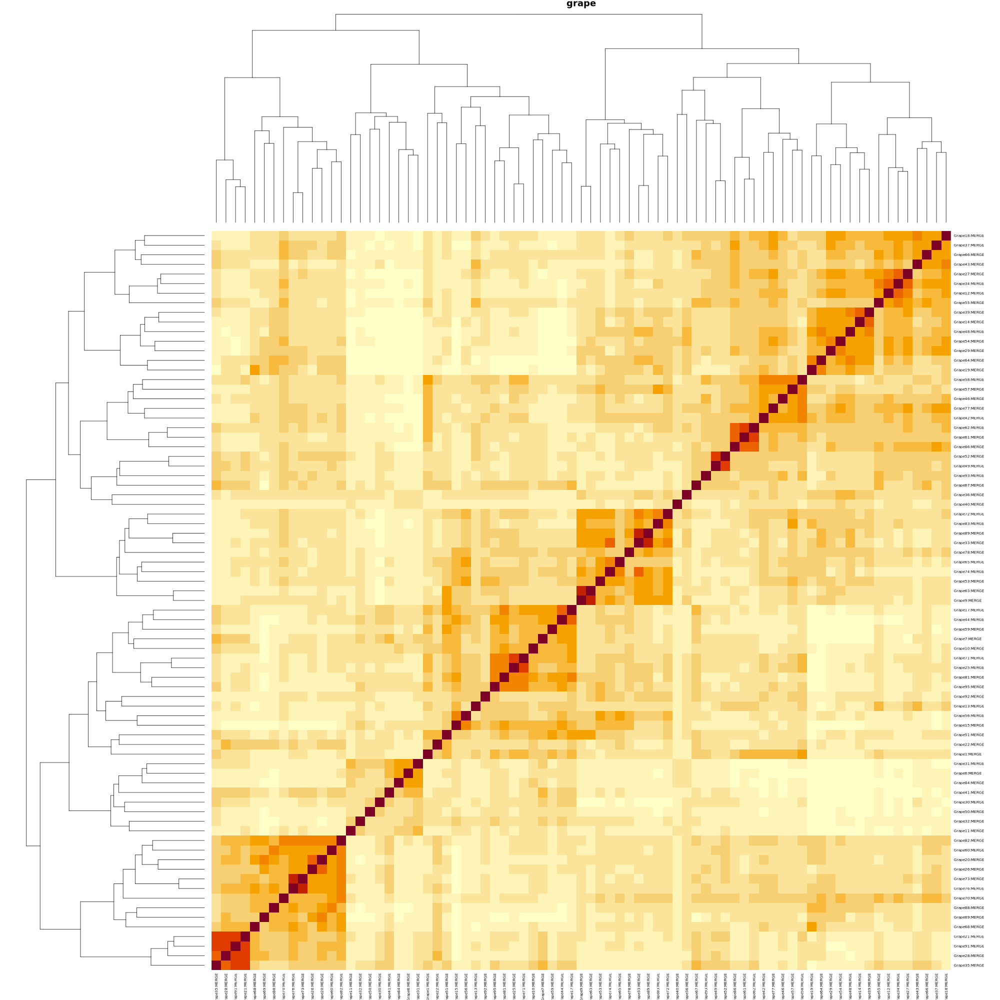

# ASSESSMENT 1: Assessing imputation accuracies

## Variables

### Four imputation algorithms

1. **MVI**: mean value imputation
2. **AFIXED**: adaptive LD-kNN imputation using fixed/default minimum loci correlation (0.9), and maximum pool distance (0.1)
3. **AOPTIM**: adaptive LD-kNN imputation with optimisation for the minimum loci correlation and maximum pool distance per locus requiring imputation
4. **LINKIMPUTE**: LD-kNN imputation designed for diploids (results presented only for the individual diploid dataset, i.e. grape data)

### 2 minor allele frequency thresholds:

1. 0.01
2. 0.05

### 10 sparsity levels (missing rate):
1. 0.01
2. 0.1
3. 0.2
4. 0.3
5. 0.4
6. 0.5
7. 0.6
8. 0.7
9. 0.8
10. 0.9

## Datasets

<!-- 1. autotetraploid *Medicago sativa* (2n=4x=32; 2.74 Gb genome; 155 samples x 124,151 biallelic loci; in-house source) -->
1. autotetraploid *Dactylis glomerata* (2n=4x=28; ~3.5 Gb genome since diploids are 1.77Gb see Huang et al., 2020; 51 samples x 50,281 biallelic loci; Huang et al., 2020 using biallelic SNPs filtered by minimum depth of 17X, maximum depth of 1000X, and minimum allele frequency of 0.05)
2. pools of diploid *Glycine max* (2n=2x=20; 1.15 Gb genome; 172 pools (each pool comprised of 42 individuals) x 39,636 biallelic loci; source: [http://gong_lab.hzau.edu.cn/Plant_imputeDB/#!/download_soybean](http://gong_lab.hzau.edu.cn/Plant_imputeDB/#!/download_soybean))
3. diploid *Vitis vinifera* (2n=2x=38; 0.5 Gb genome; 77 samples x 8,506 biallelic loci; source: [021667_FileS1 - zip file](https://academic.oup.com/g3journal/article/5/11/2383/6025349#supplementary-data))

## Preparing the datasets

1. Prepare cocksfoot data:

Link the vcf and list of samples:

```shell
conda activate rustenv
DIR=/group/pasture/Jeff/imputef/misc
cd $DIR
mkdir cocksfoot
DIR=${DIR}/cocksfoot
cd $DIR
#####################################################
### 76 cocksfoot genomes, 51 of which are tetraploids
ln -s /group/pasture/forages/Cocksfoot/HamiltonGSS/genotype/Huang_genome_HiC/mpileup/Cocksfoot_HuangHiC-genome_VarDisc_maf.02.bial.mmiss.5.dp5.filtd.recode.vcf.gz $(pwd)/cocksfoot-raw.vcf.gz
ln -s /group/pasture/forages/Cocksfoot/Huang_Genomes/Huang_sample_source_info.txt $(pwd)/Huang_sample_source_info.txt
```

Extract the tetraploid genotypes, and retain only high-depth SNPs (10X-1x10^5X) without any missing data:

```R
# dir = "/group/pasture/Jeff/imputef/misc/cocksfoot"
dir = "/group/pasture/Jeff/imputef/misc/bk/cocksfoot"
fname_input = file.path(dir, "cocksfoot-raw.vcf.gz")
fname_output = file.path(dir, "cocksfoot.vcf.gz")
fname_ids = file.path(dir, "Huang_sample_source_info.txt")
minimum_depth = 17
maximum_depth = 1e3
maf = 0.05
max_sparsity = 0.0
### Load data
vcf_orig = vcfR::read.vcfR(fname_input, verbose=TRUE) # dim: (12_739_113, 8, 328)
df_ids = read.delim(fname_ids)
### Remove multiallelic loci (i.e. >2 alleles per locus, hence represented here by more than 1 vcf row which translates to duplicated locus names)
vec_loci_names = paste(vcfR::getCHROM(vcf_orig), vcfR::getPOS(vcf_orig), sep="_")
vcf = vcf_orig[which(!(vec_loci_names %in% vec_loci_names[duplicated(vec_loci_names)])), , , drop=FALSE] # dim: (12_739_113, 8, 328)
### Retain tetraploid samples
idx_4x = which(df_ids$Ploidy == 4)
vec_4x_ids = df_ids[idx_4x, 1]
vec_samples = colnames(vcf@gt)[-1]
idx_col = which(toupper(vec_samples) %in% toupper(vec_4x_ids)) # length: 51
vcf = vcf[, , idx_col]
### Extract depths per locus per entry
mat_depth = vcfR::extract.gt(vcf, element="DP", as.numeric=TRUE)
### Define the breadth of coverage for filtering by missingness
mat_breadth = (mat_depth >= minimum_depth) & (mat_depth <= maximum_depth)
### Filter-out loci with greater than maximum sparsity (missing data)
idx_row = which(rowMeans(mat_breadth) >= (1-max_sparsity))
vcf = vcf[idx_row, , ]
mat_depth = mat_depth[idx_row, ]
mat_breadth = mat_breadth[idx_row, ]
### Calculate reference allele frequencies
vcf_to_ref_allele_frequencies = function(vcf) {
    ### Extract allele counts
    mat_allele_counts = vcfR::extract.gt(vcf, element="AD")
    mat_ref_counts = vcfR::masplit(mat_allele_counts, delim=',', record=1, sort=0)
    mat_alt_counts = vcfR::masplit(mat_allele_counts, delim=',', record=2, sort=0)
    ### Set missing allele counts to 0, if the other allele is non-missing and non-zero
    idx_for_ref = !is.na(mat_alt_counts) & (mat_alt_counts != 0) & is.na(mat_ref_counts)
    idx_for_alt = !is.na(mat_ref_counts) & (mat_ref_counts != 0) & is.na(mat_alt_counts)
    mat_ref_counts[idx_for_ref] = 0
    mat_alt_counts[idx_for_alt] = 0
    ### Calculate reference allele frequencies
    mat_genotypes = mat_ref_counts / (mat_ref_counts + mat_alt_counts)
    return(mat_genotypes)
}
mat_genotypes = vcf_to_ref_allele_frequencies(vcf)
### Remove loci with at least one missing data point
idx_row = which(rowSums(is.na(mat_genotypes)) == 0)
if (length(idx_row) < nrow(mat_genotypes)) {
    vcf = vcf[idx_row, , ]
    mat_depth = mat_depth[idx_row, ]
    mat_breadth = mat_breadth[idx_row, ]
    mat_genotypes = mat_genotypes[idx_row, ]
}
### Filter by minimum allele frequency
vec_mean_freqs = rowMeans(mat_genotypes, na.rm=TRUE)
txtplot::txtdensity(vec_mean_freqs)
idx_row = which((vec_mean_freqs > maf) & (vec_mean_freqs < (1-maf))) # length: 214_114
vcf = vcf[idx_row, , ]
mat_depth = mat_depth[idx_row, ]
mat_breadth = mat_breadth[idx_row, ]
mat_genotypes = mat_genotypes[idx_row, ]
### Retain only the 7 superscaffolds or pseudochromosomes (i.e. the largest scaffolds in the original vcf)
vec_chr_orig = vcfR::getCHROM(vcf_orig)
tab_chr_orig = sort(table(vec_chr_orig), decreasing=TRUE)
print(tab_chr_orig[1:10])
vec_7chr_names = names(tab_chr_orig)[1:7]
vec_chr = vcfR::getCHROM(vcf)
idx_row = which(vec_chr %in% vec_7chr_names) # length: 196_149
vcf = vcf[idx_row, , ]
mat_depth = mat_depth[idx_row, ]
mat_breadth = mat_breadth[idx_row, ]
mat_genotypes = mat_genotypes[idx_row, ]
### Stats
print(paste0("Final vcf dimensions: (", paste(dim(vcf), collapse=", "), ")"))
mean_depth = mean(mat_depth)
mean_breadth = mean(mat_breadth)
vec_depth_per_locus = rowMeans(mat_depth)
vec_breadth_per_sample = colMeans(mat_breadth)
vec_allele_frequencies_per_locus = rowMeans(mat_genotypes, na.rm=TRUE)
print("@@@@@@@@@@@@@@@@@@@@@@@@@@@@@@@")
print("Distribution of genome coverage (i.e. depth):")
print(paste0("Mean depth = ", mean_depth, "X"))
txtplot::txtdensity(vec_depth_per_locus)
print("@@@@@@@@@@@@@@@@@@@@@@@@@@@@@@@")
print("Distribution of breadth of genome coverage per sample:")
print(paste0("Mean breadth of coverage = ", round(100*mean_breadth), "%"))
txtplot::txtdensity(vec_breadth_per_sample)
print("@@@@@@@@@@@@@@@@@@@@@@@@@@@@@@@")
print("Distribution of mean reference allele frequencies across samples:")
txtplot::txtdensity(vec_allele_frequencies_per_locus)
print("@@@@@@@@@@@@@@@@@@@@@@@@@@@@@@@")
print("How many scaffolds did we lose?")
vec_chr_orig = vcfR::getCHROM(vcf_orig)
vec_chr = vcfR::getCHROM(vcf)
print("Original list:")
print(table(vec_chr_orig))
print("After filtering:")
print(table(vec_chr))
### Output
vcfR::write.vcf(vcf, file=fname_output)
```

2. Prepare soybean data (pool by most genetically related):

```shell
#!/bin/bash
conda activate bcftools
DIR=/group/pasture/Jeff/imputef/misc
cd $DIR
### (2) pools of diploid *Glycine max*
for chr in $(seq 1 20); do wget http://gong_lab.hzau.edu.cn/static/PLimputeDB/download/species/soybean/panel/soybean_impute_Chr${chr}.vcf.gz; done
ls soybean_impute_Chr* > soybean-vcf.txt
for f in $(cat soybean-vcf.txt); do echo $f; gunzip ${f}; bgzip ${f%.gz*}; tabix ${f}; done
bcftools concat $(cat soybean-vcf.txt) -Ov -o soybean-indi_temp.vcf
time Rscript poolify.R \
    soybean-indi_temp.vcf \
    42 \
    100 \
    soybean.vcf
rm soybean_impute_Chr* soybean-vcf.txt soybean-indi_temp.vcf
### (3) diploid grape from the LinkImpute paper with missing data filled in with MVI to be fair with the other datasets
time Rscript \
    ssv2vcf.R \
    LinkImpute.data.grape.num.raw.txt \
    soybean.vcf
mv LinkImpute.data.grape.num.raw.txt.vcf grape.vcf
```


3. Generate pools from soybean individual genotype data, where we assume each individual per pool are perfectly equally represented (best-case scenario in the real-world).

- **poolify.R**

```R
args = commandArgs(trailingOnly=TRUE)
# args = c("/group/pasture/Jeff/imputef/misc/soybean-indi_temp.vcf", "42", "100", "/group/pasture/Jeff/imputef/misc/soybean.vcf")
vcf_fname = args[1]
min_pool_size = as.numeric(args[2])
depth = as.numeric(args[3])
out_fname = args[4]
print("###############################################################################################################")
print("Pooling individual diploid genotypes, i.e. each pool is comprised of {min_pool_size} most closely-related samples using k-means clustering using 1000 evenly indexes loci")
print("Note: assumes each individual per pool are perfectly equally represented (best-case scenario in the real-world)")
vcf = vcfR::read.vcfR(vcf_fname)
vec_loci_names = paste(vcfR::getCHROM(vcf), vcfR::getPOS(vcf), vcfR::getREF(vcf), sep="_")
vec_sample_names = colnames(vcf@gt)[-1]
### Extract biallelic diploid allele frequencies
G = matrix(NA, nrow=length(vec_loci_names), ncol=length(vec_sample_names))
GT = vcfR::extract.gt(vcf, element="GT")
G[(GT == "0/0") | (GT == "0|0")] = 1.0
G[(GT == "1/1") | (GT == "1|1")] = 0.0
G[(GT == "0/1") | (GT == "0|1") | (GT == "1|0")] = 0.5
rm(GT)
gc()
rownames(G) = vec_loci_names
colnames(G) = vec_sample_names
### Create n pools of the most related individuals
print("Clustering. This may take a while.")
PCA = prcomp(G, rank=100)
C = PCA$rotation
p = length(vec_loci_names)
# C = t(G[seq(from=1, to=p, length=1000), ])
clustering = kmeans(x=C, centers=200, iter.max=20)
vec_clusters = table(clustering$cluster)
vec_clusters = vec_clusters[vec_clusters >= min_pool_size]
n = length(vec_clusters)
GT = matrix("AD", nrow=p, ncol=n+1)
pb = txtProgressBar(min=0, max=n, initial=0, style=3)
for (i in 1:n) {
    idx = which(clustering$cluster == i)
    q = rowMeans(G[, idx])
    for (j in 1:p) {
        # j = 1
        ref = rbinom(n=1, size=depth, prob=q[j])
        alt = rbinom(n=1, size=depth, prob=(1-q[j]))
        GT[j, (i+1)] = paste0(ref, ",", alt) ### skipping the first column containing the FORMAT field "AD"
    }
    setTxtProgressBar(pb, i)
}
close(pb)
colnames(GT) = c("FORMAT", paste0("Pool-", c(1:n)))
### Create the output vcfR object
vcf_out = vcf
str(vcf_out)
str(vcf_out@gt)
vcf_out@gt = GT
fname_vcf_gz = paste0(out_fname, ".gz")
vcfR::write.vcf(vcf_out, file=fname_vcf_gz)
system(paste0("gunzip -f ", fname_vcf_gz))
print(paste0("Output: ", out_fname))
```

4. Prepare grape data (convert space-delimited genotype data from LinkImpute paper):

- **ssv2vcf.R**

```R
args = commandArgs(trailingOnly = TRUE)
# args = c("/group/pasture/Jeff/imputef/misc/LinkImpute.data.apple.num.raw.txt", "/group/pasture/Jeff/imputef/misc/soybean.vcf")
# args = c("/group/pasture/Jeff/imputef/misc/LinkImpute.data.grape.num.raw.txt", "/group/pasture/Jeff/imputef/misc/soybean.vcf")
fname_geno_txt = args[1] 
fname_geno_dummy_vcf = args[2]
dat = read.table(fname_geno_txt, header=TRUE, sep=" ")
vcf = vcfR::read.vcfR(fname_geno_dummy_vcf)
idx_col_start = 7
n = nrow(dat)
p = ncol(dat) - (idx_col_start-1)
vec_loci_names = colnames(dat)[idx_col_start:ncol(dat)]
vec_pool_names = dat$IID
G = dat[, idx_col_start:ncol(dat)]
# ### Missing data assessment
# idx_row_without_missing = apply(G, MARGIN=1, FUN=function(x){sum(is.na(x))==0})
# idx_col_without_missing = apply(G, MARGIN=2, FUN=function(x){sum(is.na(x))==0})
# sum(idx_row_without_missing)
# sum(idx_col_without_missing)
# sum(is.na(G)) / prod(dim(G))
# ### Fill missing with mean (because LinkImpute fails to finish running at MAF=0.25 for reasons I do not know)
# ploidy = 2
# pb = txtProgressBar(min=0, max=p, style=3)
# for (j in 1:p) {
#     # j = 1
#     idx_missing = which(is.na(G[, j]))
#     G[idx_missing, j] = round(mean(G[, j], na.rm=TRUE) * ploidy)
#     setTxtProgressBar(pb, j)
# }
# close(pb)
### Create meta, fit and gt fields of the vcfR object
mat_loci_ids = matrix(gsub("^X", "chr_", unlist(strsplit(unlist(strsplit(vec_loci_names, "[.]")), "_"))), ncol=3, byrow=TRUE)
### Randomly choose the alternative alleles as the genotype data (*.raw file) do not have that information.
vec_alt = c()
vec_alleles = c("A", "T", "C", "G")
for (i in 1:nrow(mat_loci_ids)) {
    vec_alt = c(vec_alt, sample(vec_alleles[vec_alleles != mat_loci_ids[i,3]], size=1))
}
vec_chr = unique(mat_loci_ids[,1])
META = c("##fileformat=VCFv", paste0("##", vec_chr), "##Extracted from text file.")
FIX = cbind(mat_loci_ids[,1], mat_loci_ids[,2], vec_loci_names, mat_loci_ids[,3], vec_alt, rep(NA, each=p), rep("PASS", each=p), rep(NA, each=p))
colnames(FIX) = c("CHROM", "POS", "ID", "REF", "ALT", "QUAL", "FILTER", "INFO")
GT = matrix("", nrow=p, ncol=(n+1))
GT[,1] = "GT"
colnames(GT) = c("FORMAT", vec_pool_names)
pb = txtProgressBar(min=0, max=n, style=3)
for (i in 1:n) {
    for (j in 1:p) {
        ### We're assuming that the counts in G are for the reference alleles
        if (is.na(G[i, j])) {
            GT[j, (i+1)] = "./."
        } else {
            if (G[i, j] == 0) {
                GT[j, (i+1)] = "1/1"
            } else if (G[i, j] == 1) {
                GT[j, (i+1)] = "0/1"
            } else if (G[i, j] == 2) {
                GT[j, (i+1)] = "0/0"
            } else {
                GT[j, (i+1)] = "./."
            }
        }
    }
    setTxtProgressBar(pb, i)
}
close(pb)
### Create the new vcfR object
vcf_new = vcf
vcf_new@meta = META
vcf_new@fix = FIX
vcf_new@gt = GT
print(vcf)
print(vcf_new)
### Save and unzip the object
vcfR::write.vcf(vcf_new, file=paste0(fname_geno_txt, ".vcf.gz"))
system(paste0("gunzip -f ", fname_geno_txt, ".vcf.gz"))
vcf_new_loaded = vcfR::read.vcfR(paste0(fname_geno_txt, ".vcf"))
print(vcf_new_loaded)
```


## Assess the genetic relationships between samples per dataset

```R
dir = "/group/pasture/Jeff/imputef/res/"
vec_fnames = paste0("/group/pasture/Jeff/imputef/misc/", c("grape.vcf", "cocksfoot.vcf", "soybean.vcf"))
setwd(dir)
### Allele frequency extraction
fn_extract_allele_frequencies = function(vcf) {
    vec_loci_names = paste(vcfR::getCHROM(vcf), vcfR::getPOS(vcf), vcfR::getREF(vcf), sep="_")
    vec_pool_names = colnames(vcf@gt)[-1]
    mat_allele_counts = vcfR::extract.gt(vcf, element="AD")
    ### Extract biallelic diploid allele frequencies if the AD field is missing
    if (sum(is.na(mat_allele_counts)) == prod(dim(mat_allele_counts))) {
        GT = vcfR::extract.gt(vcf, element="GT")
        mat_genotypes = matrix(NA, nrow=nrow(mat_allele_counts), ncol=ncol(mat_allele_counts))
        mat_genotypes[(GT == "0/0") | (GT == "0|0")] = 1.0
        mat_genotypes[(GT == "1/1") | (GT == "1|1")] = 0.0
        mat_genotypes[(GT == "0/1") | (GT == "0|1") | (GT == "1|0")] = 0.5        
    } else {
        mat_ref_counts = vcfR::masplit(mat_allele_counts, delim=',', record=1, sort=0)
        mat_alt_counts = vcfR::masplit(mat_allele_counts, delim=',', record=2, sort=0)
        ### Set missing allele counts to 0, if the other allele is non-missing and non-zero
        idx_for_ref = which(!is.na(mat_alt_counts) & (mat_alt_counts != 0) & is.na(mat_ref_counts))
        idx_for_alt = which(!is.na(mat_ref_counts) & (mat_ref_counts != 0) & is.na(mat_alt_counts))
        mat_ref_counts[idx_for_ref] = 0
        mat_alt_counts[idx_for_alt] = 0
        ### Calculate reference allele frequencies
        mat_genotypes = mat_ref_counts / (mat_ref_counts + mat_alt_counts)
    }
    ### Label the loci and pools
    rownames(mat_genotypes) = vec_loci_names
    colnames(mat_genotypes) = vec_pool_names
    ### Output
    return(mat_genotypes)
}
### Assess genotype relationships per dataset
for (i in 1:length(vec_fnames)) {
    # i = 1
    fname = vec_fnames[i]
    fname_png = gsub(".vcf", ".png", basename(fname))
    print("=====================================")
    print(fname)
    vcf = vcfR::read.vcfR(fname, verbose=FALSE)
    # print(vcf)
    mat_geno = fn_extract_allele_frequencies(vcf)
    # str(mat_geno)
    C = cor(mat_geno, use="complete.obs")
    png(fname_png, width=2000, height=2000)
    heatmap(C, scale="none", main=gsub(".vcf", "", basename(fname)))
    dev.off()
}
```





## Prepare LinkImpute for testing against diploid imputation

*prepare_linkimpute.sh*

```shells
#!/bin/bash
DIR=/group/pasture/Jeff/imputef/res
cd $DIR
mkdir linkimpute/
cd linkimpute/
wget http://www.cultivatingdiversity.org/uploads/5/8/2/9/58294859/20210706_linkimpute.tar.gz
tar -xvzf 20210706_linkimpute.tar.gz
rm 20210706_linkimpute.tar.gz
java -jar LinkImpute.jar -h
```


## Metrics

1. Concordance: $c = {{1 \over n} \Sigma_{i=1}^{n} p}$, where: $p=
\begin{cases}
0 \text{ if } \hat g \ne g_{true}\\
1 \text{ if } \hat g = g_{true}
\end{cases}
$.
This is used for genotype classes, i.e., binned allele frequencies: $g = {{1 \over {ploidy}} round(q*ploidy)}$, here $q = P(allele)$. Note that there is alternative way of defining these genotype classes with strict boundaries, i.e., homozygotes have fixed allele frequencies.
2. Mean absolute error: $mae = {{1 \over n} \Sigma_{i=1}^{n}|\hat q - q_{true}|}$.
3. Coefficient of determination: $R^2 = { 1 - {{\Sigma_{}^{}(\hat q - q_{true})^2} \over {\Sigma_{}^{}(\hat q_{true} - \bar q_{true})^2}} }$


## Execution

```shell
### Create slurm scripts with specific memory and time limits per dataset
DIR=/group/pasture/Jeff/imputef/res
cd $DIR
for DATASET in "grape" "cocksfoot" "soybean"
do
    if [ $DATASET == "grape" ]
    then
        sed 's/--job-name="imputef"/--job-name="VvImp"/g' perf.slurm | \
            sed 's/--mem=250G/--mem=100G/g' | \
            sed 's/--time=14-0:0:00/--time=0-0:30:00/g' > perf_${DATASET}.slurm
    elif [ $DATASET == "cocksfoot" ]
    then
        sed 's/--job-name="imputef"/--job-name="DgImp"/g' perf.slurm | \
            sed 's/--time=14-0:0:00/--time=15-0:0:00/g' > perf_${DATASET}.slurm
    else
        sed 's/--job-name="imputef"/--job-name="GmImp"/g' perf.slurm | \
            sed 's/--mem=250G/--mem=200G/g' > perf_${DATASET}.slurm
    fi
done

### Submit array jobs for each dataset
for DATASET in "grape" "cocksfoot" "soybean"
do
    if [ $DATASET == "grape" ]
    then
        INI=1
        FIN=20
    elif [ $DATASET == "cocksfoot" ]
    then
        INI=21
        FIN=40
    else
        INI=41
        FIN=60
    fi
    echo ${DATASET}: ${INI}-${FIN}
    sbatch --array=${INI}-${FIN} perf_${DATASET}.slurm
done

### Monitor the jobs
conda activate rustenv
DIR=/group/pasture/Jeff/imputef/res
cd $DIR
squeue -u jp3h | sort
tail slurm-*_*.out
grep -n -i "err" slurm-*_*.out | grep -v "mean absolute" | grep -v "CANCELLED AT 2024-04-15T16"
wc -l *-performance_assessment-maf_*missing_rate_*.csv
ls -lhtr
time Rscript perf_plot.R ${DIR}

### After all jobs have finished, move the output and plot:
mkdir output
mv *-performance_assessment-maf_*-missing_rate_*.csv output/
time Rscript perf_plot.R \
    ${DIR}/output
```

# ASSESSMENT 2: 6 additional empirical datasets

## Datasets

1. alfalfa: [https://datadryad.org/downloads/file_stream/828](https://datadryad.org/downloads/file_stream/828)
2. posidonia: [https://datadryad.org/downloads/file_stream/1514201](https://datadryad.org/downloads/file_stream/1514201)
3. aspen: [https://datadryad.org/downloads/file_stream/4603](https://datadryad.org/downloads/file_stream/4603)
4. iris: [https://datadryad.org/downloads/file_stream/2941452](https://datadryad.org/downloads/file_stream/2941452)
5. potato: [https://figshare.com/ndownloader/files/24193742](https://figshare.com/ndownloader/files/24193742)
6. urochloa: [https://datadryad.org/downloads/file_stream/107691](https://datadryad.org/downloads/file_stream/107691)

## Execution

Bash commands to run imputef and the non-built-in grid-search optimisation (please note that each imputef command was ran with Slurm but presented here as for-loops for simplicity):

```shell
#####################################################
# Divide Urochloa MockGenome into 40 mock chromomes #
#####################################################
L=$(grep -v "^#" urochloa.vcf | wc -l)
S=$(echo "$L / 40" | bc)
echo $L
echo $S
grep "^#" urochloa.vcf > urochloa_headers.tmp
grep -v "^#" urochloa.vcf > urochloa_non_headers.tmp
i=0
for N in $(seq $S $S $L)
do
    i=$(echo "$i + 1" | bc)
    N0=$(echo "($N - $S) + 1" | bc)
    if [ $i -eq 40 ]
    then
        N=$L
    fi
    sed -n ${N0},${N}p urochloa_non_headers.tmp > urochloa-${i}.tmp
    sed -i "s/^MockRefGenome/MockChr_${i}/g" urochloa-${i}.tmp
done
mv urochloa.vcf urochloa.vcf.bk
cat urochloa_headers.tmp urochloa-*.tmp > urochloa.vcf

#########################################################
# AFIXED with LD estimated across and within chromosome #
#########################################################
for VCF in alfalfa.vcf posidonia.vcf aspen.vcf iris.vcf potato.vcf urochloa.vcf
do
    time imputef \
        -f $VCF \
        --n-threads=32
    time imputef \
        -f $VCF \
        --restrict-linked-loci-per-chromosome \
        --n-threads=32
done

###############################################
# AOPTIM with LD estimated across chromosomes #
###############################################
for VCF in alfalfa.vcf posidonia.vcf aspen.vcf iris.vcf
do
    time imputef \
        -f $VCF \
        --min-loci-corr=-1 \
        --max-pool-dist=-1 \
        --n-threads=32
done

##############################################
# AOPTIM with LD estimated within chromosome #
##############################################
for VCF in alfalfa.vcf posidonia.vcf aspen.vcf iris.vcf potato.vcf urochloa.vcf
do
    time imputef \
        -f $VCF \
        --restrict-linked-loci-per-chromosome \
        --min-loci-corr=-1 \
        --max-pool-dist=-1 \
        --n-threads=32
done

###########################################
# GRID-SEARCH OPTIMISATION (NON-BUILT-IN) #
###########################################
grep "^#" urochloa.vcf > urochloa_headers.tmp
cp urochloa_headers.tmp urochloa_sample_1.vcf
cp urochloa_headers.tmp urochloa_sample_2.vcf
cp urochloa_headers.tmp urochloa_sample_3.vcf
grep -v "^#" urochloa.vcf | shuf -n 10000 >> urochloa_sample_1.vcf
grep -v "^#" urochloa.vcf | shuf -n 10000 >> urochloa_sample_2.vcf
grep -v "^#" urochloa.vcf | shuf -n 10000 >> urochloa_sample_3.vcf
### Find the optimal l-loci to use for minimum loci correlation, and maximum distance
### i.e. the combination of these 2 parameters which minimises the mean absolute error between expected and predicted allele frequencies.
for SAMPLE in 1 2 3
do
    echo 'l,k,corr,dist,mae' > grid_search_sample_${SAMPLE}.csv
    for l in 10 20 30
    do
        for k in 2 5 10
        do
            for corr in 0.1 0.2 0.3 0.4 0.5 0.6 0.7 0.8 0.9
            do
                for dist in 0.1 0.2 0.3 0.4 0.5 0.6 0.7 0.8 0.9
                do
                    echo "@@@@@@@@@@@@@@@@@@@@@@@@"
                    echo ${l},${k},${corr},${dist}
                    time imputef \
                        -f urochloa_sample_${SAMPLE}.vcf \
                        --min-l-loci=${l} \
                        --min-k-neighbours=${k} \
                        --min-loci-corr=${corr} \
                        --max-pool-dist=${dist} \
                        --n-threads=32 > log_sample_${SAMPLE}.tmp
                    fname_out=$(tail -n1 log_sample_${SAMPLE}.tmp | cut -d':' -f2 | tr -d ' ')
                    mae=$(grep "Expected imputation accuracy in terms of mean absolute error:" log_sample_${SAMPLE}.tmp | cut -d':' -f2 | tr -d ' ')
                    echo ${l},${k},${corr},${dist},${mae} >> grid_search_sample_${SAMPLE}.csv
                    rm $fname_out log_sample_${SAMPLE}.tmp
                done
            done
        done
    done
    awk -F',' 'NR == 1 || $5 < min {min = $5; min_line = $0} END {print min_line}' grid_search_sample_${SAMPLE}.csv
done
# Merge output
head -n1 grid_search_sample_1.csv > grid_search.csv
for SAMPLE in 1 2 3
do
    tail -n+2 grid_search_sample_${SAMPLE}.csv >> grid_search.csv
done
```

Find the optimal paramters:

```R
df = read.csv("grid_search.csv")
df = aggregate(mae ~ l + k + corr + dist, data=df, FUN=mean)
attach(df)
txtplot::txtplot(mae)
txtplot::txtplot(l, mae)
txtplot::txtplot(k, mae)
txtplot::txtplot(corr, mae)
txtplot::txtplot(dist, mae)
idx = which(mae == min(mae))[1]
print(df[idx, ])
print("@@@@@@@@@@@@@@@@@@@@@@@@@@@@@@@@@@@@@@@@@@@@@@@@@@@@@@@@@@@@@@@@@@@@@@@@@@@@@@@@@@@@@@@@@@@@@@@@")
print(paste0("--min-l-loci=", l[idx], " --min-k-neighbours=", k[idx], " --min-loci-cor=", corr[idx], "; --max-pool-dist=", dist[idx], "; expected MAE=", min(mae)))
print("@@@@@@@@@@@@@@@@@@@@@@@@@@@@@@@@@@@@@@@@@@@@@@@@@@@@@@@@@@@@@@@@@@@@@@@@@@@@@@@@@@@@@@@@@@@@@@@@")
```

For Urochloa, AFIXED using the non-built-in-grid-search optimisation optimal parameters:

```shell
#########################################################
# AFIXED with LD estimated across and within chromosome #
#########################################################
time imputef \
    -f urochloa.vcf \
    --restrict-linked-loci-per-chromosome \
    --min-loci-corr=0.4 \
    --max-pool-dist=0.1 \
    --n-threads=32
```

## Analysis

Find significant relationships between imputef performance and dataset properties

```R
df = data.frame(
    mae_afixed_across_scaf = c(0.797, 0.0893, 0.0927, 0.0635, 0.0504, NA),
    mae_afixed_within_scaf = c(0.7038, 0.1416, 0.1491, 0.1442, 0.0992, 0.0797),
    mae_aoptim_across_scaf = c(0.0558, 0.0748, 0.0681, 0.032, NA, NA),
    mae_aoptim_within_scaf = c(0.0931, 0.1364, 0.1316, 0.1281, 0.042, 0.0932),
    n_loci = scale(c(17514, 18021, 55474, 82237, 233627, 1526917), center=TRUE, scale=TRUE),
    n_entries = scale(c(238, 133, 190, 169, 380, 275), center=TRUE, scale=TRUE),
    sparsity = scale(c(0.28, 0.06, 0.1, 0.33, 0.39, 0.55), center=TRUE, scale=TRUE),
    n_scaffolds = scale(c(3623, 18018, 11620, 34238, 12, 40), center=TRUE, scale=TRUE)
)
for (trait in c("mae_afixed_across_scaf", "mae_afixed_within_scaf", "mae_aoptim_across_scaf", "mae_aoptim_within_scaf")) {
    # trait = "mae_afixed_across_scaf"
    print("@@@@@@@@@@@@@@@@@@@@@@@@@@@@@@@@@@@@@@@@@@@@@@@@@@@@@@@@@@")
    print(paste0("Trait: ", trait))
    print("@@@@@@@@@@@@@@@@@@@@@@@@@@@@@@@@@@@@@@@@@@@@@@@@@@@@@@@@@@")
    models = list(
        mod_1 = eval(parse(text=paste0("lm(", trait, " ~ 1, data=df)"))),
        mod_2 = eval(parse(text=paste0("lm(", trait, " ~ n_loci, data=df)"))),
        mod_3 = eval(parse(text=paste0("lm(", trait, " ~ n_entries, data=df)"))),
        mod_4 = eval(parse(text=paste0("lm(", trait, " ~ sparsity, data=df)"))),
        mod_5 = eval(parse(text=paste0("lm(", trait, " ~ n_scaffolds, data=df)"))),
        mod_6 = eval(parse(text=paste0("lm(", trait, " ~ n_loci + n_entries, data=df)"))),
        mod_7 = eval(parse(text=paste0("lm(", trait, " ~ n_loci + sparsity, data=df)"))),
        mod_8 = eval(parse(text=paste0("lm(", trait, " ~ n_loci + n_scaffolds, data=df)"))),
        mod_9 = eval(parse(text=paste0("lm(", trait, " ~ n_entries + sparsity, data=df)"))),
        mod_10 = eval(parse(text=paste0("lm(", trait, " ~ n_entries + n_scaffolds, data=df)"))),
        mod_11 = eval(parse(text=paste0("lm(", trait, " ~ sparsity + n_scaffolds, data=df)"))),
        mod_12 = eval(parse(text=paste0("lm(", trait, " ~ n_loci + n_entries + sparsity, data=df)"))),
        mod_13 = eval(parse(text=paste0("lm(", trait, " ~ n_loci + n_entries + n_scaffolds, data=df)"))),
        mod_14 = eval(parse(text=paste0("lm(", trait, " ~ n_loci + sparsity + n_scaffolds, data=df)"))),
        mod_15 = eval(parse(text=paste0("lm(", trait, " ~ n_entries + sparsity + n_scaffolds, data=df)"))),
        mod_16 = eval(parse(text=paste0("lm(", trait, " ~ n_entries + n_loci + sparsity + n_scaffolds, data=df)"))),
        mod_17 = eval(parse(text=paste0("lm(", trait, " ~ n_loci * n_entries, data=df)"))),
        mod_18 = eval(parse(text=paste0("lm(", trait, " ~ n_loci * sparsity, data=df)"))),
        mod_19 = eval(parse(text=paste0("lm(", trait, " ~ n_loci * n_scaffolds, data=df)"))),
        mod_20 = eval(parse(text=paste0("lm(", trait, " ~ n_entries * sparsity, data=df)"))),
        mod_21 = eval(parse(text=paste0("lm(", trait, " ~ n_entries * n_scaffolds, data=df)"))),
        mod_22 = eval(parse(text=paste0("lm(", trait, " ~ sparsity * n_scaffolds, data=df)"))),
        mod_23 = eval(parse(text=paste0("lm(", trait, " ~ n_loci * n_entries * sparsity, data=df)"))),
        mod_24 = eval(parse(text=paste0("lm(", trait, " ~ n_loci * n_entries * n_scaffolds, data=df)"))),
        mod_25 = eval(parse(text=paste0("lm(", trait, " ~ n_loci * sparsity * n_scaffolds, data=df)"))),
        mod_26 = eval(parse(text=paste0("lm(", trait, " ~ n_entries * sparsity * n_scaffolds, data=df)"))),
        mod_27 = eval(parse(text=paste0("lm(", trait, " ~ n_entries * n_loci * sparsity * n_scaffolds, data=df)"))),
        mod_28 = eval(parse(text=paste0("lm(", trait, " ~ n_loci:n_entries, data=df)"))),
        mod_29 = eval(parse(text=paste0("lm(", trait, " ~ n_loci:sparsity, data=df)"))),
        mod_30 = eval(parse(text=paste0("lm(", trait, " ~ n_loci:n_scaffolds, data=df)"))),
        mod_31 = eval(parse(text=paste0("lm(", trait, " ~ n_entries:sparsity, data=df)"))),
        mod_32 = eval(parse(text=paste0("lm(", trait, " ~ n_entries:n_scaffolds, data=df)"))),
        mod_33 = eval(parse(text=paste0("lm(", trait, " ~ sparsity:n_scaffolds, data=df)"))),
        mod_34 = eval(parse(text=paste0("lm(", trait, " ~ n_loci:n_entries:sparsity, data=df)"))),
        mod_35 = eval(parse(text=paste0("lm(", trait, " ~ n_loci:n_entries:n_scaffolds, data=df)"))),
        mod_36 = eval(parse(text=paste0("lm(", trait, " ~ n_loci:sparsity:n_scaffolds, data=df)"))),
        mod_37 = eval(parse(text=paste0("lm(", trait, " ~ n_entries:sparsity:n_scaffolds, data=df)"))),
        mod_38 = eval(parse(text=paste0("lm(", trait, " ~ n_entries:n_loci:sparsity:n_scaffolds, data=df)")))
    )
    mod_null = models[[1]]
    for (i in 2:length(models)) {
        # i = 17
        mod_x = models[[i]]
        A = anova(mod_null, mod_x)
        if (!is.na(A$Pr[2]) & (A$Pr[2] < 0.05)) {
            print("==========================================================")
            print(paste0("Trait: ", trait, " | ", "Model: ", names(models)[i]))
            print("==========================================================")
            print(A)
            print(anova(mod_x))
            print(summary(mod_x))
            print("==========================================================")
        }
    }
    print("@@@@@@@@@@@@@@@@@@@@@@@@@@@@@@@@@@@@@@@@@@@@@@@@@@@@@@@@@@")
}
```